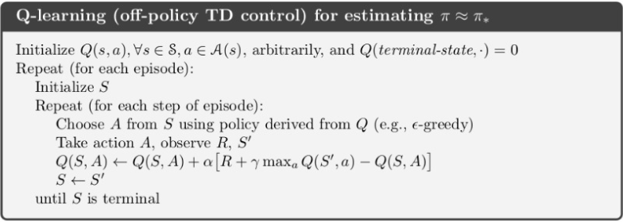
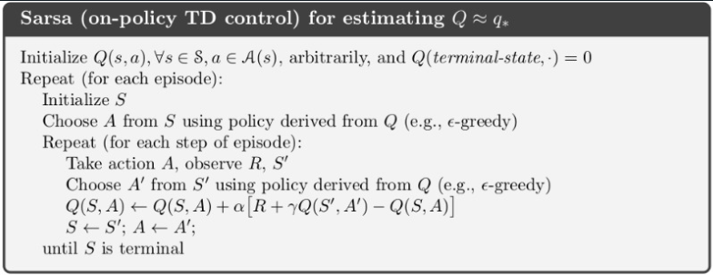

# Aprendizaje por Refuerzo (Reinforcement Learning)

- [Aprendizaje por Refuerzo (Reinforcement Learning)](#aprendizaje-por-refuerzo-reinforcement-learning)
  - [Introducción](#introducción)
  - [Multi-armed Bandit](#multi-armed-bandit)
  - [Markov Decision Process](#markov-decision-process)
    - [Política](#política)
    - [Problemas con los MDPs](#problemas-con-los-mdps)
  - [Aprendizaje Temporal](#aprendizaje-temporal)
    - [Q-Learning](#q-learning)
    - [SARSA](#sarsa)
    - [Q-Learning Aproximado](#q-learning-aproximado)

## Introducción

El aprendizaje por refuerzo se basa en la teoría conductivista de Skinner. En este tipo de aprendizajes, un angete, en base a pruebas y errores, aprende a interactuar con un entorno guiado por una recompensa.

El agente a diferencia de otros aprendizajes como el supervisado no conoce la mejor acción a tomar pero si es capaz de valorar las acciones que toma y aprender de ellas.

Algunas características a tomar en cuenta en el RL son:

- El agente genera sus propios datos de entrenamiento mediante la interacción con el entorno.
  - El entorno es incierto, no es determinista. Existen probabilidades ocultas que desconocemos.
- No existe una accion correcta, el agente debe aprender a tomar la mejor decisión.
- El premio mayor puede ser a largo plazo.
  - El premio o recompensa indica lo bien o mal que ha sido la acción del agente. El objetivo es obtener la mayor acumulación de premios.
  - Por lo tanto, el objetivo es maximizar el cumulo de premios esperados.
- El tiempo y la secuencia de acciones son importantes.
  - Para ello debemos tomar una secuencia de acciones que mire el futuro, no unicamente el presente.

## Multi-armed Bandit

El problema del Multi-armed Bandit es un problema clásico en el aprendizaje por refuerzo. En este problema, el agente se enfrenta a una máquina tragaperras con varias palancas, cada una con una recompensa diferente. El objetivo del agente es encontrar la palanca que le proporciona la mayor recompensa.

En estos problemas hay una fase de exploración y una fase de explotación. En la fase de exploración el agente prueba todas las palancas para obtener información sobre las recompensas. En la fase de explotación el agente toma la mejor decisión basada en la información obtenida.

El agente debe empezar probando de forma aleatoria cada palanca y ir evaluando las recompensas obtenidas. A medida que obtiene información dejara de actuar de forma tan aleatoria y empezara a explotar la palanca que mejor recompensa le da según la información obtenida.

En estos problemas cada accion sobre el entorno no influye sobre el siguiente, es decir, no hay un estado que se vea afectado por la acción anterior. Usar mucho una palanca no cambia las probabilidades del resto de palancas.

## Markov Decision Process

En los Markov Decision Process a diferencia de en los problemas de Multi-armed Bandit las acciones del agente si influyen en el entorno y en las recompensas futuras.
En estos casos conocemos las probabilidades de transición entre estados y las recompensas asociadas a cada estado.

### Política

La política es el mapeo entre los estados y las acciones. Es decir, la política define que acción tomar en cada estado basado en la información que tenemos por el agente cuando alcance cada uno de los estados. Se representa como $\pi$ y el objetivo es encontrar la política óptima $\pi^*$ que maximice la recompensa acumulada. Para ello usamos el Value Iteration.

La fórmula del Value Iteration es la siguiente:

$$
V_{k+1}(s) = \max_a \sum_{s'} T(s,a,s') [R(s,a,s') + \gamma V_k(s')]
$$

donde:

- $V_k(s)$ es el valor del estado $s$ en la iteración $k$.
- $a$ es una acción.
- $T(s,a,s')$ es la probabilidad de transición del estado $s$ al estado $s'$ dado que se tomó la acción $a$.
- $R(s,a,s')$ es la recompensa recibida al transitar del estado $s$ al estado $s'$ tomando la acción $a$.
- $\gamma$ es el factor de descuento, que representa la importancia de las recompensas futuras.

El objetivo es iterar esta fórmula hasta que la diferencia entre $V_{k+1}(s)$ y $V_k(s)$ sea menor que un umbral definido, indicando que se ha alcanzado la convergencia.

### Problemas con los MDPs

La realidad es que no se suelen conocer las funciones de transición ni las recompensas asociadas a cada estado.
Dos estrategias para resolver este problema son:

- **Model-based**: Aprender un modelo del entorno y luego usar value iteration para encontrar la política óptima. Muy costoso computacionalmente.
- **Model-free**: Aprender directamente de la experiencia usando métodos de aprendizaje por episodios. Un episodio consiste en exponer al agente a un ciclo completo desde un estado inicial a uno final.
  - **Monte Carlo**: El premio se calcula al final de cada episodio.
  - **Aprendizaje Temporal**: El premio se calcula en cada paso del episodio.

## Aprendizaje Temporal

### Q-Learning

**Q-Learning**: En cada episodio se dan diferentes pasos bien aleatorios o bien tomando la mejor decisión en base a la información obtenida y se actualiza la función Q. La eleccion de la acción se hace en base a la variable $\epsilon$ que indica la probabilidad de tomar una acción aleatoria. A medida que se va obteniendo información se va reduciendo el valor de $\epsilon$. Tambien se suele ir reduciendo el valor de $\alpha$ que indica la importancia de la nueva información. De esta forma en un comienzo empezamos explorando y a medida que obtenemos información vamos explotando la mejor acción.

### SARSA

**SARSA**: Igual que Q-Learning en vez de jugar tomar la mejor acción del estado al que estamos transitando, se selecciona el valor Q de una acción seleccionada según la política actual. Es decir, esta segunda accion, al igual que la primera, esta sujeta al valor de $\epsilon$ y puede ser una accion exploración o explotación.

### Q-Learning Aproximado

**Q-Learning Aproximado**: Q-Learning no es viable para problemas con muchos estados. En estos casos se representan los estados como vectores de rasgos y se aproxima la función Q.
